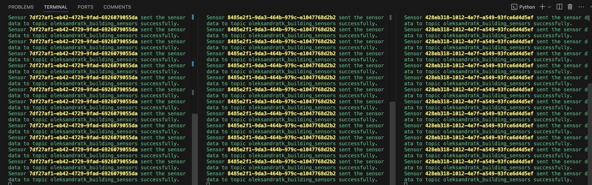
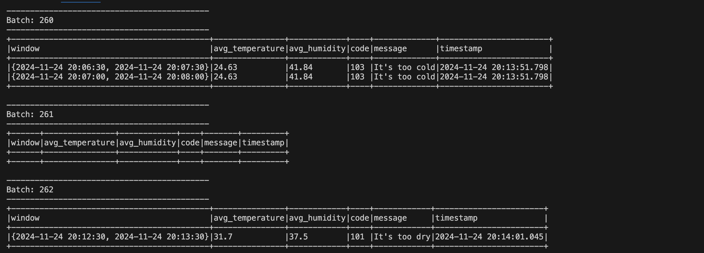
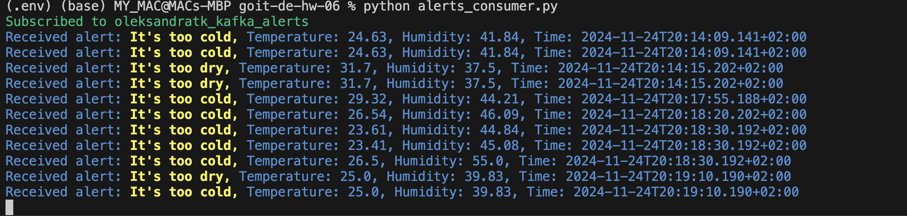

# goit-de-hw-05
Data Engineering. Implemented Apache Kafka for message interchange in the Internet of Things (IoT) domain. Developed a system for collecting sensor data, preprocessing them with the help of Spark Streaming and sending alerts, utilizing Python for efficient implementation.

> **_NOTE:_**   For normal operation of kafka package it is recommended to use a virtual environment with python3.11 version. Kafka package has an open issue with python3.12 and python3.13 versions for the moment of writing.

To create and activate virtual environment and install necessary packages perform the next commands:

```commandline
python3.11 -m venv venv

source venv/bin/activate

pip install -r requirements.txt
```

# STEP 1. 

To imitate the operation of a building sensors and produce sensor data run the script ```sensor_data_producer.py```. It will generate and send objects that contain sensor id, temperature, humidity, time of data collection.
To imitate several sensors run the script in several separate terminals.

```commandline
python sensor_data_producer.py
```



# STEP 2

Run the ```spark_stream.py ```script. This script sets up a Kafka Consumer to receive data from a specified topic. The real-time data will then be processed using Spark Streaming. To handle late events, we will leverage the ```slidingWindows``` and ```watermarks``` options. During processing, the script calculates the average temperature and humidity. If these values exceed the normal range, alerts are generated and sent to a designated Kafka topic.

```commandline
python spark_stream.py
```



# STEP 3
To receive temperature and humidity alerts run the script ```alerts_consumer.py```. Consumer will receive data from the topic and print these alerts.

```commandline
python alerts_consumer.py
```

